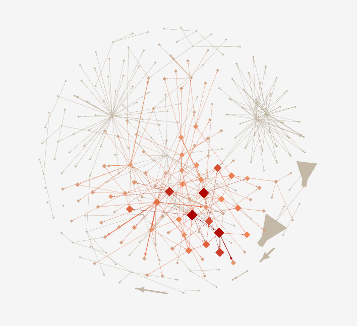

<!-- .slide: data-background-image="img/reveGeneral.png" -->
<!-- .slide: class="hover"-->

# Le corpus “brouhaha” au défi de la visualisation de texte

 Servanne Monjour (servanne.monjour@paris-sorbonne.fr)

 <!-- .element: class="logo" -->

§§§§§§§§§§§§§§§§§§§§§§§§§§§§§§§§§§§§§§§§§§§§§
<!-- .slide: data-background-image="img/panInstin.png" -->
<!-- .slide: class="hover"-->

Défi de visualisation, défi cartographique

===

Je vais vous montrer aujourd'hui 2 projets inachevés, et à vrai dire peut-être inachevables (c'est du moins la conclusion à laquelle je parviens parfois à la fin de certaines journées de travail).

Le titre de ma communication est un peu ambitieux ou du moins assez trompeur : le "défi de la visualisation de texte" donne l'impression que je vais vous montrer de beaux graphiques, pour être honnête ce ne sera pas vraiment le cas.

Ce colloque a pour titre et pour thématique "cartographie du web littéraire francophone", et j'ai un peu bugué face à ce titre, qui me renvoyais à un problème à la fois conceptuel et méthodologique auquel je dois moi-même faire face : l'établissement et le balisage d'un corpus (plus ou moins) natif numérique, à des fins de visualisation de texte.

Mon approche, aujourd'hui sera donc d'abord méthodologique et épistémologique - même si, par la bande, elle a vocation à interroger la nature de la littérature sur le web.

La fouille et la visualisation de corpus informatisées constituent une branche florissante des Humanités numériques, y compris des humanités numériques littéraires, qui relèvent de facto de la pratique cartographique : visualiser un corpus, c'est en proposer une représentation graphique reposant sur un certains nombre de codes et de conventions préalablement définies par le chercheur/codeur/concepteur de l'outil, et par les possibilités de la machine. Visualiser un corpus, c'est aussi avoir déterminé ce qu'était le corpus - généralement, c'est là où les problèmes commencent.

Ce que je veux questionner, pour être plus précise, c'est la relation entre deux gestes d'écriture : une écriture cartographique, qui serait donc la nôtre, celle des chercheurs ; et un geste d'écriture "web", celui des écrivains et écrivaines qui ont choisi cette forme d'Expression et de diffusion.

§§§§§§§§§§§§§§§§§§§§§§§§§§§§§§§§§§§§§§§§§§§§§
<!-- .slide: data-background-image="img/IliadLorenzo.png" -->

===

La visualisation cartographique de la littérature, ça peut d'abord être cela, celle du texte, du récit. Ici une carte des escales dans l'Iliade. Représentation cartographique arrimée à une réalité géographique.

Il s'agit de "mapper" des personnages ou des éléments diégétiques d'un récit ; des productions littéraires dans leur dimension éditoriales ; ou encore des auteurs eux-mêmes.

§§§§§§§§§§§§§§§§§§§§§§§§§§§§§§§§§§§§§§§§§§§§§
<!-- .slide: data-background-image="img/GrandjeanTopTenComplet.jpg" -->

===
La visualisation de corpus littéraire, cela peut aussi ressembler à cela : des effets de réseau que l'on tente d'expliciter. ici la cartographie d'un réseau "livres préférés" calculés en fonction des tweets de lecteur, réalisée par Martin Geandjean.

Il existe une déclinaison large des cartographies possibles, qui permettent d'explorer nos corpus et de nous aider à les interpréter.

Si vous commencez déjà à vous ennuyer ou à vous inquiétez, voire à vous révolter face à mes propos, c'est probablement que vous vous trouvez au bon endroit, à savoir dans un colloque rassemblant une communauté de littéraires (*even* Marcello).

Je citerai ici Stéfan et Geoffrey, afin de dissiper peut-être un grand malentendu :

§§§§§§§§§§§§§§§§§§§§§§§§§§§§§§§§§§§§§§§§§§§§§
<!-- .slide: data-background-image="img/instinss.jpg" -->
<!-- .slide: class="hover" -->

>Nous reconnaissons que la réaction sceptique chez le littéraire est tout à fait naturelle et nous estimons d’ailleurs qu’une bonne dose de scepticisme est essentielle lorsque se conjuguent analyse informatisée et herméneutique. Cela dit, nous souhaitons remettre en cause l’image dominante que nous fournit la société de l’ordinateur comme générateur prodigieux de données infaillibles et de graphiques inéluctables. Ce que l’on ignore souvent, c’est que l’ordinateur, grâce à la nature même du numérique, peut s’avérer une aide très puissante pour faire proliférer le nombre et les types de représentations d’un texte. Loin d’en réduire la souplesse et la richesse, les outils informatiques peuvent servir à multiplier la matière brute qui mène à de nouveaux constats, de nouvelles associations, de nouveaux arguments. La machine est l’engin du heureux hasard, contrainte seulement par l’imagination de son utilisateur. (Sinclair et Rockwell 2015)

<!-- .element: style="font-size:1.8rem" -->

===

Je dissiperai d'ailleurs tout suite tout éventuel malentendu, en précisant que je ne me compte absolument pas au rang des spécialistes de la visualisation - je m'y suis collée pendant une petite année à l'Université McGill (l'an dernier), où j'étais certes très bien entourée par Stéfan Sinclair, mais où je suis trop peu de temps pour faire autre chose qu'acquérir les bases de ce champ d'étude, ouvrir une première porte pour apercevoir immédiatement derrière des dizaines d'autres portes.

La communication que je vais présenter aujourd'hui propose un petit bilan de cette initiation à la visualisation, et plus particulièrement le récit de son échec. Un échec puisque si, au tout début de mon année de postdoc, je me voyais déjà partir à l'assaut du langage python et produire des dessins absolument spectaculaires en 3 mois, je me suis finalement cassé les dents sur l'étape préliminaire, la fameuse constitution du corpus.

Mais il ne s'agit peut-être finalement que d'un échec partiel car ces difficultés techniques ont en fait nourri ma réflexion théorique, à la fois sur la littérature numérique mais aussi sur son étude.

§§§§§§§§§§§§§§§§§§§§§§§§§§§§§§§§§§§§§§§§§§§§§
<!-- .slide: data-background-image="img/nowhere1.png" -->

## Cartographier le web littéraire ?

===

Car visualiser, oui, certes, mais visualiser quoi exactement ? Où commence et où s'arrête le corpus littéraire sur le web ? Est-il seulement juste de s'arrêter au web, d'ailleurs, pour penser une littérature qui serait plutôt "numérique" ? Le web, en d'autres termes, est-il une frontière - ne serait-ce que sa propre frontière ?

§§§§§§§§§§§§§§§§§§§§§§§§§§§§§§§§§§§§§§§§§§§§§
<!-- .slide: data-background-image="img/nowhere2.png" -->
<!-- .slide: class="hover" -->

* Le chercheur-cartographe
* Un corpus numérique éditorialisé et éditorialisable
* L'écrivain-architecte

===

Au risque d'enfoncer quelques portes ouvertes, je vais baliser quelques principes théoriques qu'il est bon de rappeler dès lors que l'on souhaite constituer un corpus "natif numérique" à des fins d'analyses automatisées. Quelques remarques préalables :

- un corpus, en soit, n'existe pas : c'est le chercheur qui le construit toujours. Nous sommes donc des cartographes - cela étant, nous sommes des cartographes quelque peu déboussolés aujourd'hui, puisque nos outils, tout comme les modalités de production de la littérature contemporaine ont changé. Et parmi ces outils, on trouve en tout premier lieu la fameuse visualisation de corpus - *text mining* et *data visualisation* - qui occupent un vaste territoire au sein des HN. Avec une humilité qu'il faut tout de suite souligner, même si on a tendance à l'oublier : une carte n'est pas tant un outil de connaissance qu'un moyen d'objectivation et, dans le cadre de la visualisation de corpus notamment, une véritable méthode heuristique dont l'intérêt réside moins dans le résultat (c'est-à-dire la visualisation), que dans la méthodologie.

- nos corpus natifs numériques sont mouvants, fragiles, éphémères, hétérogènes bref, éditorialisés. Or peut-on seulement cartographier le web, dans la mesure où celui-ci engage un processus d'éditorialisation, que l'on peut définir, pour simplifier lourdement, comme un processus d'ouverture dans le temps et dans l'espace ?

- nos corpus natifs numériques sont aussi, quoiqu'on en dise, marginaux. La question de l'institutionnalisation comme de la légitimation est certes déjà mise sur les rails, et des colloques tels que celui-ci en sont la preuve - mais avouons que la locomotive ne tourne pas encore vraiment à plein régime, et que la réflexion sur le sujet reste tributaires de groupes certes très actifs et dynamiques, mais parfois un peu isolés du reste des collègues - le nom du groupe qui nous accueille et qui organise le colloque en est la preuve.

Comment, donc, cartographier les marges ? Des marges qui d'ailleurs, parfois encore, sont volontaires, se posent comme des conditions à un projet ou à une esthétique?

- Pour compléter cette sainte trinité, nous avons aujourd'hui des écrivain.e.s "architectes". Je m'inscris ici dans la ligne droite du concept d'éditorialisation, dont l'une des conséquences consiste à dire que l'écriture, sur le web, relève d'une construction architecturale : construire son texte, c'est en même temps construire son espace. Ce à quoi j'ajouterai que, bien souvent, construire une oeuvre littéraire numérique, c'est aussi construire un espace marginal.

§§§§§§§§§§§§§§§§§§§§§§§§§§§§§§§§§§§§§§§§§§§§§
<!-- .slide: data-background-image="img/nowhere1.png" -->
<!-- .slide: class="hover" -->

>Pratiquant le web, une métaphore m’est souvent utile, celle du ballon atmosphérique – quand on le gonfle à l’hélium, l’enveloppe plus lourde que l’air repose à terre. Il faut un minimum de gonflage pour que la forme s’ébauche, et le gonflage total pour que la forme définitive se manifeste et que s’effectue le mouvement ascensionnel. Dans un livre, le format précède le contenu (feuille pliée, cahiers brochés) – dans un site, les contenus seuls définissent le cadre et la forme. L’équivalent presque fractal entre la forme générale de l’œuvre et les éléments qui la composent (l’équilibre d’une phrase de Proust, rapporté à l’équilibre global de la Recherche) est une constante en esthétique – elle vaut probablement pour ce domaine encore à nous largement inconnu, la puissance localisée d’un billet web, et l’univers formel que devient le site complet, et les perspectives qu’il offre. (François Bon, *Après le livre*)

<!-- .element: style="font-size:1.8rem" -->

===

Comment, donc cartographier la marge ? On cartographie je crois un geste d'écriture de l'écrivain-architecte, un objet processuel, performatif, un espace en construction, plutôt qu'un espace inscrit là définitivement - c'est le pb des corpus instables.

Le défi me semble plus grand qu'il n'y paraît, puisqu'il y a de fait une relation probablement complexe, voire une opposition entre 2 gestes d'écriture, celui du cartographe et celui de l'architecte. C'est cette relation que je souhaiterais interroger dans ma communication. Ainsi, c'est la notion même de *corpus* qui me semble difficile à saisir dans le cadre d'un effort de cartographie, qui est un **effort de cohérence** là où la théorie de la littérature contemporaine a tendance à insister sur la dissémination, l'hétérogénéité formelle et médiatique, bref le "brouhaha" (ruffel).

L'hypotèse que je vais défendre est celle de la dimension performative et esthétique de nos gestes cartographiques, notamment et surtout dans le cadre de projets littéraires en ligne qui ont déjà prévu, en leur sein, un système d'archivage ou de documentation. Pour le dire plus simplement, dans l'exemple que je vais traiter aujourd'hui, tous nos efforts cartographiques ont été dans une certaine mesure un échec du point de vue de l'objectif scientifique annoncé, mais un succès en termes de construction ou de métaconstruction de nos objets d'étude.

<!--
- Technique 1 : propagation hypertexte
Cartographie d'un réseau (centrée texte-objet - étendue et logique d'un corpus), tentative d'archivage, éditorialiser un corpus

- Technique 2 : moissonnage python HTML
cartographie d'un brouhaha (centrée contenu des objets : médias, textes, contenus thématiques, voix chorale)

- Une métaconstruction : l'architecte
geste édito de carto: dessiner de la cohérence.
Exemple de wiki : documenter = créer
-->
%%%%%%%%%%%%%%%%%%%%%%%%%%%%%%%%%%%%%%%%%%%%%
<!-- .slide: data-background-image="img/20181210_154554.jpg" -->

## Cas d'étude. _Général Instin_ : un corpus fantôme

source image: _Quand on écrira l’histoire secrète du vingt et unième siècle…_ sur remue.net  

<!-- .element: class="source" -->

===
J'ai choisi de travailler sur un corpus à fois limite mais en même temps très typique de ce que nous sommes amenés à étudier en lit num (je dépasse le web, qui pour moi se dépasse en fait lui-même). Le corpus du collectif littéraire et artistique Instin, dont je vais aussi rapidement que possible vous baliser l'histoire, afin d'illustrer le niveau de complexité que peut poser la lit num en termes de définition et délimitation de corpus.

Hinstin, c'est d'abord le nom d'un général français du XIXe siècle, mort et enterré en 1905 au cimetière du Montparnasse. Le caveau est orné d'un vitrail représentant le portrait photographique du défunt or, un portrait lui même en train de se décomposer - dans une belle mise en abîme de la mort.

§§§§§§§§§§§§§§§§§§§§§§§§§§§§§§§§§§§§§§§§§§§§§
<!-- .slide: data-background-image="img/20181210_154554_rr.jpg" -->

§§§§§§§§§§§§§§§§§§§§§§§§§§§§§§§§§§§§§§§§§§§§§
<!-- .slide: data-background-image="img/vitrailOriginal.jpg" data-background-size="contain"-->

source image: _introduction au feuilleton collectif Général Instin_ sur remue.net

<!-- .element: class="source" -->

===

En 1997, ce portrait en décomposition attire l'attention d'un groupe d'artistes et d'écrivains, parmi lesquels la photographe Juliette Soubrier, qui saisit plusieurs clichés de ce portrait fantomatique.

La même année (1997) Patrick Chatelier, écrivain français que l'on connaît notamment aujourd'hui pour être l'un des principaux éditeurs de publie.net, reprend cette photo pour la proposer comme contrainte créative lors d'une soirée de performance au squat artistique de la Grange aux belles (Paris).

§§§§§§§§§§§§§§§§§§§§§§§§§§§§§§§§§§§§§§§§§§§§§
<!-- .slide: data-background-image="img/ProcesDeLArt.jpg" data-background-size="contain"-->

===

Un mot peut-être sur la Grange-aux-Belles : haut lieu de la culture alternative parisienne dans les années 1990, le Squat de la Grange-aux-Belles était un bâtiment privé illégalement occupé par un collectif artistique, qui tentait de mettre en place des projets de création communs, et qui était basé sur un mode de gouvernance collectif.

Un lieu inscrit à la marge, donc, marge à la fois de la légalité, mais aussi d'un certain modèle institutionnel de l'art et de la légitimation artistique - qui repose sur l'individuation de l'auteur (cf. Nathalie Heinich)

L'endroit a depuis été détruit par la ville de Paris, entraînant d'ailleurs la disparition de nombreuses oeuvres et fresques murales qui faisaient la réputation du lieu.

§§§§§§§§§§§§§§§§§§§§§§§§§§§§§§§§§§§§§§§§§§§§§
<!-- .slide: data-background-image="img/revueGeste.png" data-background-size="contain"-->

source image: revue-geste.fr  <!-- .element: class="source" -->

===

Mais en 1997 nous n'en sommes pas encore là, et cette photo du Général va inspirer les artistes qui occupent le squat ou qui y transitent pour quelques jours, quelques semaines.

Il va marquer le début d'un collectif relativement informel (bien que très pro-actif), qui donnera lieu à plusieurs événements littéraires (des lectures, des performances, des ateliers, etc.).

Au début, une première forme d'inscription se met en place dans une poignée de revues littéraires imprimées : la revue *Geste*, par exemple.

§§§§§§§§§§§§§§§§§§§§§§§§§§§§§§§§§§§§§§§§§§§§§
<!-- .slide: data-background-image="img/item-026.png" data-background-size="contain" -->

source image: remue.net

<!-- .element: class="source" -->
===
Lorsque la plateforme publie.net est créée autour de 1999-2000, GI l'insvestit presque immédiatement.

Entre temps, Hinstin perd volontairement son "H" qui le faisait personnage historique, pour devenir un matériau narratif, platisque, sémiotique. Il devient ainsi Général Instin svt abrégé GI.

Publie va jouer un rôle d'agrégateur / centralisateur des productions consacrées à Instin : poèmes, récits, images en grand nombre (photos, peintures, etc.), vidéos mais aussi des enregistrements sonores (gardant une trace des ateliers, lectures, festivals où Instin poursuit son investissement des marges de la littérature).

Il faut dire que GI, sur le web, performe quelque peu son statut fantomatique en s'inscrivant de facto comme archive.

Désormais, GI a pris racine dans l'hypertexte, et commence à hanter le web.

§§§§§§§§§§§§§§§§§§§§§§§§§§§§§§§§§§§§§§§§§§§§§
<!-- .slide: data-background-image="img/horsSil.png" data-background-size="contain" -->

source image: Hors-Sol  <!-- .element: class="source" -->

===
Ainsi, il se permet des incursions sur d'autres plateformes, des revues numériques comme, par exemple, *Hors-sol*

§§§§§§§§§§§§§§§§§§§§§§§§§§§§§§§§§§§§§§§§§§§§§
<!-- .slide: data-background-image="img/item-036.png" data-background-size="contain" -->

source image: generalinstin.net  <!-- .element: class="source" -->

===

Des sites dédiés à des projets fonctionnant de manière relativement autonome, dans une logique transmédiatique -
ce que nous avons nommé "Spin-off" - comme ici le site web generalinstin.net, qui consitue une archive de *Climax*, publié par ailleurs en version imprimée (j'y reviendrai).

§§§§§§§§§§§§§§§§§§§§§§§§§§§§§§§§§§§§§§§§§§§§§
<!-- .slide: data-background-image="img/interditSaufInstin.jpg" data-background-size="contain" -->

===

Instin, c'est aussi de la poésie urbaine, reposant sur un mélange entre l'affichage et le détournement des espaces institutionnels et publics existants...

§§§§§§§§§§§§§§§§§§§§§§§§§§§§§§§§§§§§§§§§§§§§§
<!-- .slide: data-background-image="img/instin_1_redimensionnee-2.jpg" data-background-size="contain" -->

===

...du land-art...

§§§§§§§§§§§§§§§§§§§§§§§§§§§§§§§§§§§§§§§§§§§§§
<!-- .slide: data-background-image="img/sans_titre-2.jpg" data-background-size="contain" -->

===

... des festivals de rue avec performances...

§§§§§§§§§§§§§§§§§§§§§§§§§§§§§§§§§§§§§§§§§§§§§
<!-- .slide: data-background-image="img/TwitterInstin.png" data-background-size="contain" -->

source image: Twitter, profil Instin  <!-- .element: class="source" -->

===

Et, bien sûr, GI investi aussi les écritures profilaires, avec un compte FB et Twitter (partagé par plusiers membres du collectif qui publient messages et images en fonction de leurs envies du moment, sans nécessairement consulter les autres).

Sur twitter, GI habite dans l'au-delà.

§§§§§§§§§§§§§§§§§§§§§§§§§§§§§§§§§§§§§§§§§§§§§
<!-- .slide: data-background-image="img/Hinstin-famille.jpg" data-background-size="contain" -->

source image: BNF  <!-- .element: class="source" -->

===

À noter qu'à force de se performer dans son propre archivage, Général Instin finit par être rattrapé par l'Histoire et sa grande H dont il avait tenté de s'émanciper.

Au cours des années 2000 en effet, Retour de bâton : le collectif découvre que la famille Hinstin (avec son H), a en fait partie liée depuis longtemps avec la littérature et les arts. On retrouve des Hinstin chez Jarry ou chez Kessel, notammnent.

La BNF, surtout, dispose même d'un fonds d'archive photo de la famille classée dans les dossiers consacrés à Lautréamont (la rumeur voulant qu'Isidore Ducasse ait entretenu une relation très étroite avec son professeur Hinstin, frère de notre général).

Comme quoi l'Histoire et l'histoire ne sont finalement pas si cloisonnées. Et le GI nous fait parfois penser à une somme de petites anecdotes reliées entre elles.  

§§§§§§§§§§§§§§§§§§§§§§§§§§§§§§§§§§§§§§§§§§§§§
<!-- .slide: data-background-image="img/instinPapier.png" -->

===
Enfin, depuis 2015, Instin est devenu une figure auctoriale à part entière. Pour fêter cela, il a réinvesti le modèle éditorial imprimé, aux Éditions du Nouvel Attila, qui lui a même dédié une collection à lui seul : la collection Othello. Trois ouvrages ont été déjà publiés : une anthologie, un récit *Climax*, une traduction de *Spoon River* d'Edgar Lee Masters, augmentés de nouveaux poèmes instiniens et fantomatiques - pour ceux qui ne le sauraient pas ou plus, Spoon River est un recueil de poèmes en forme d'épitaphes (il s'agit d'un hypertexte non-numérique, reprenant le schéma d'un cimetière, avec les tombes qui dialoguent entre elles).

§§§§§§§§§§§§§§§§§§§§§§§§§§§§§§§§§§§§§§§§§§§§§
<!-- .slide: data-background-image="img/corpusFantome.png" -->

source image: _lexique généraliste_ sur remue.net

<!-- .element: class="source" -->

===
Instin est donc un corpus fantôme.
La métaphore peut sembler facile pour parler d'une figure elle-même spectrale, mais elle revendiquée par le collectif.

>Somme de tous les éléments, écrits, images, gestes, etc., qui constituent le projet GI toujours-en-train-d’apparaître. Ce corpus fantôme se développe par diverses fractales et avatars en vue de constituer une entité géante, totem composé de l’ensemble des matériaux instin qui s’exprimera, grâce à un programme aléatoire dirigé par ordinateur, dans toutes les langues disparues depuis les premiers balbutiements de l’humanité.
Nous sommes un corps sans cesse modifié. / Nous sommes un corps sans cesse modifiant le monde auquel nous appartenons. / Nous sommes un corps sans cesse modifiant la qualité de l’appartenance

Cette métaphore sied par ailleurs très bien à notre corpus qui, par sa nature processuelle, semble toujours un peu sur le point de se dérober, voire sur le point de disparaître.

§§§§§§§§§§§§§§§§§§§§§§§§§§§§§§§§§§§§§§§§§§§§§
<!-- .slide: data-background-image="img/mashupInstin.png" data-background-size="contain" -->
<!-- .slide: class="hover"-->

### De Hinstin à Instin

* Une contrainte créative (pour un groupe d'artistes)
* Un projet collectif (mais "sans engagement", ni "projet esthétique")
* Une figure **H**-istorique devenue romanesque
* Une figure auctoriale (qui signe des livres et vous parle sur Twitter)

source image: _La place du mort_ sur remue.net

<!-- .element: class="source" -->

===

§§§§§§§§§§§§§§§§§§§§§§§§§§§§§§§§§§§§§§§§§§§§§
<!-- .slide: data-background-image="img/editionInstin.jpg" -->
<!-- .slide: class="hover"-->

### Un modèle hors-livre (?) ou Mar[GI]nal

* Occupation des marges (les marges de la ville puis du web)
* Dissémination sur plusieurs supports/plateformes
* Investissement de l'espace public
* *Avec* le livre plutôt que *contre* le livre !

source image: _Général Instin_ sur facebook.com

<!-- .element: class="source" -->

===

En tant que corpus, Instin pose des difficultés parce qu'il se déploie non pas tant hors-le-livre mais dans les marges de notre modèle éditorial moderne.

Depuis le squat de la Grange aux belles, Instin s'est toujours s'inscrit relativement à la marge - des institutions littéraires ou éditoriales traditionnelles.

Il est disséminé sur plusieurs supports, numériques/non-numériques, sur plusieurs plateformes, via des médias différents.

Cela étant, de l'investissement d'un squat dans une rue de Paris jusqu'à l'investissement du web, des réseaux sociaux qui sont détournés pour créer un profil "fictif", nous avons tendance à croire qu'il y a là une même stratégie d'occupation des marges et de détournement des institutions, qui est essentiel pour comprendre les mutations qui affectent la notion même de littérature.

§§§§§§§§§§§§§§§§§§§§§§§§§§§§§§§§§§§§§§§§§§§§§
<!-- .slide: data-background-image="img/mashupInstin.png" -->
<!-- .slide: class="hover"-->

### Une littérature "brouhaha"

> le [fait] littéraire aujourd’hui apparaît en très grande partie comme une arène conflictuelle composée d’une sphère publique hégémonique reposant sur l’imprimé et d’une multitude d’espaces publics contre-hégémoniques relevant plutôt d’une « littérature-brouhaha » (exposée, performée, in situ, multi-support) avec de très nombreuses circulations entre eux. »
>
> Lionel Ruffel, _Brouhaha, Les Mondes du contemporain_

<!-- .element: style="font-size:1.6rem; text-align:justify" -->

===
Lionel Ruffel a proposé le terme de "littérature brouhaha" pour qualifier ce passage d'un imaginaire du littéraire centré sur le livre comme objet-support, à un imaginaire du littéraire centré sur une action et une pratique : la publication.
[CITER]

§§§§§§§§§§§§§§§§§§§§§§§§§§§§§§§§§§§§§§§§§§§§§
<!-- .slide: data-background-image="img/mashupInstin.png" -->
<!-- .slide: class="hover"-->

## Cartographier le corpus fantôme : récit de 2 (plus ou moins) échecs
* La problématique de l'inventaire et de la collecte
* Quelques conclusions à partir des premières visualisations (plus ou moins) réussies

===

%%%%%%%%%%%%%%%%%%%%%%%%%%%%%%%%%%%%%%%%%%%%%
<!-- .slide: data-background-image="img/10458166_10153074634228797_4994304635406227180_n.jpg" -->

## Tentative cartographique numéro 1 : baliser le collectif (approche réseau)

===

Un travail que j'ai mené avec Nicolas

§§§§§§§§§§§§§§§§§§§§§§§§§§§§§§§§§§§§§§§§§§§§§
<!-- .slide: data-background-image="img/mashupInstin.png" -->
<!-- .slide: class="hover"-->

## Objectifs du projet
* Questionner le concept d'éditorialisation (du texte littéraire *et* d'une archive littéraire)
* Cartographier la dynamique collective (étude du réseau)
* Qu'est-ce qu'Instin ? + Quelles études littéraires pour comprendre Instin ?

===

A l'origine de notre projet, c'est l'intuition que ce qui était à l'oeuvre, et qui est toujours, avec le Général Instin est de nature à éclairer le questionnement de fond de la théorie de l'éditorialisation, et son rapport à la littérature.  

§§§§§§§§§§§§§§§§§§§§§§§§§§§§§§§§§§§§§§§§§§§§§
<!-- .slide: data-background-image="img/mashupInstin.png" -->
<!-- .slide: class="hover"-->

### Méthodologie de recherche

* Recherche, collecte et indexation du corpus
* Chaîne d'archivage, encodage et édition
* Exploration des données
* Réflexion épistémologique sur le projet

===

Devant un tel corpus, nous avons procédé de manière très organique, en élaborant notre méthodologie progressivement, de manière itérative en fonction des éléments que nous mettions à jour.

Nous pouvons séparer les différentes opérations en 4 tâches distinctes :
1. la recherche, la collection et l'indexation du corpus
2. l'implémentation d'une chaine de traitement pour encoder, archiver et éditorialiser le corpus
3. l'exploration et l'analyse des données récoltées
4. une réflexion continue, dont les axes se sont détachés et éclaircis progressivement. Ce sont ces axes de réflexions que nous présentons aujourd'hui, dans une version non aboutie.

[A nouveau, au-delà de la question ontologique de ce qu'est Instin, de ce qu'il nous dit des modes de publications, de la littérature contemporaine, du réel, lorsque chacun de ces champs d'actions ou champs d'études sont confrontés et travaillés dans la culture numérique, au delà de ces questions donc, a rapidement émergé la question épistémologique de ce que nous faisions d'Instin, dans une démarche auto-réflexive, récursive, tout à fait fertile puisque venant en miroir éclairer la première.]

§§§§§§§§§§§§§§§§§§§§§§§§§§§§§§§§§§§§§§§§§§§§§
<!-- .slide: data-background-image="img/inventaireAtom.png" -->
<!-- .slide: class="hover"-->

### _inventaire(.md)_

* Recherche, collecte et indexation :

    1. Exploration du corpus par propagation hypertextuelle
    2. Captation systématique (inachevée)
    3. Ajout de sources jugées antérieures à "GI"

===

L'inventaire s'est déroulé en trois temps :

Dans un premier temps, l'objectif était de faire un ballon d'essai avec 10 items, de réfléchir à leur indexation, aux métadonnées dont nous aurions besoin. Nous sommes partis d'un article publié sur la plateforme Remue.net, nous l'avons indexé, et recensé les liens hypertextes contenus dans le texte.

§§§§§§§§§§§§§§§§§§§§§§§§§§§§§§§§§§§§§§§§§§§§§
<!-- .slide: data-background-image="img/propagationHypertextuelle.png"  data-background-size="contain" -->

===

Nous avons alors suivi le premier lien hypertexte, menant au texte intitulé «La campagne d'Egypte» (article1524.html), puis le second, et ainsi de suite, chaque nouveau texte nous menant soit à de nouveaux items, soit à des items déjà collectés.

Cette démarche n'était pas tout à fait arbitraire, même si son point de départ l'était, car elle était guidée par l'idée que les textes s'écrivaient ensemble, se répondaient entre eux, et formaient en fait une certaine unité, informe pour le moment, mais dont les hyperliens traçaient des pistes de lecture et d'écriture, comme le début d'une matrice de sens qu'il restait à dévoiler.

**Notre hypothèse de recherche guidait donc complètement notre méthodo, cette hypothèse était à la fois juste et en même temps plus complexe qu'on ne l'avait imaginé**

Ce que l'on n'avait pas encore découvert, c'est qu'une main était derrière à la manoeuvre pour complexifier la matrice en éditant les textes publiés de nouveaux hyperliens vers des textes plus récents.

§§§§§§§§§§§§§§§§§§§§§§§§§§§§§§§§§§§§§§§§§§§§§
<!-- .slide: data-background-image="img/inventaireAtom.png" -->
<!-- .slide: class="hover"-->

### _inventaire(.xml)_

* Recherche, collecte et indexation :

  1. Exploration du corpus par propagation hypertextuelle
  2. Captation systématique (en cours)
  3. Ajout de sources antérieures à GI

Corpus final de l'expérience : <i class="fa fa-arrow-right"></i> 76 _manifestations_ (dont 90% sources web)

===

Corpus final de l'expérience = 76 objets, collectés une à une, donc un processus tt de même assez long et complexe...

§§§§§§§§§§§§§§§§§§§§§§§§§§§§§§§§§§§§§§§§§§§§§
<!-- .slide: data-background-image="img/data-workflow.png" data-background-size="contain" -->

===

La suite de la chaine de traitement, la voici : de la collection où l'on retrouve l'inventaire dont je viens de parler, jusqu'à l'éditorialisation de l'archive.

La chaine est présentée ici de manière linéaire là les différentes étapes ont été conçues simultanément. On retrouve en rouge les moulinettes d'encodage, de traitement ou d'extraction des données. Le point notable de cette chaine est que nous nous basons sur BaseX, un système de gestion de base de données XML, qui nous permet à la fois de produire et d'encoder l'archive, mais aussi de l'exploiter, que ce soit à des fins d'analyse, ou à des fins de mise en ligne et de publication.

§§§§§§§§§§§§§§§§§§§§§§§§§§§§§§§§§§§§§§§§§§§§§
<!-- .slide: data-background-image="img/archiveTEI.png" data-background-size="contain" -->
<!-- .slide: class="hover"-->

### TEI
* HTML to TEI
* Paradoxe

===

Nous avons fait le choix de produire une archive en TEI, selon un schéma qui continue d'évoluer au fil de notre recherche.

Ce choix qui était dans un premier temps presque une évidence vis à vis de notre démarche (réaliser une archive éditorialisée/able) s'est avéré paradoxal vis-à-vis de la nature du corpus.

Notre approche était initialement centrée sur le texte, alors que le corpus se révèle beaucoup plus transmédiatique qu'une simple collection de texte, et donc potentiellement peu adéquate aux orientations de la TEI. Par ailleurs, il n'était pas question de procéder à un encodage fin des aspects de mise en forme, pour lequel se déploie toute la puissance de la TEI sur de l'encodage de manuscrit par exemple.

Mais surtout, pour ceux qui ont déjà eu à faire à la conception ou la manipulation d'un schéma XML, l'idée même d'un "schéma Général Instin" semble un paradoxe complet, pour ne pas dire une aberration.

§§§§§§§§§§§§§§§§§§§§§§§§§§§§§§§§§§§§§§§§§§§§§
<!-- .slide: data-background-image="./img/Composition3Graphes_large.png" data-background-size="cover" -->
<!--  .slide: class="hover"-->

### Conclusions des (quelques) premières visualisations (finalement)
* Un collectif ouvert, mais structuré
* un ensemble ouvert et dynamique, mais fini
* centralité de certains acteurs et plateformes

===
Et pourtant, notre travail d'archivage nous a progressivement amenés à cerner le corpus en un ensemble, certes ouvert, mais fini. Avec un nombre d’auteurs, de contributions, de plateformes maîtrisables. Elle nous montre par ailleurs que c'est un corpus malgré tout organisé et éditorialisé.

En fait, ce que nous a montré nos premiers pas dans la constitution de l'archive GI, c'est qu'il existe malgré tout des noeuds de cristallisation, des acteurs à la centralité plus ou moins prégnante, des formes, elles-mêmes investies de leur dispositif.

§§§§§§§§§§§§§§§§§§§§§§§§§§§§§§§§§§§§§§§§§§§§§

 <!-- .element: width="60%" -->

_Spatialisation (Fruchterman Reingold) et Centralité de vecteur propre_  <!-- .element: style="font-size: 1.4rem" -->

===
C'est notamment ce que nous révèle cette première spatialisation du réseau de documents déjà référencés dans l'archive, calculée à partir des liens hypertexte inter-documents.

L'algorithme de spatialisation choisi est volontairement neutre, de manière à révéler des relations, des lignes de forces, mais sans trop les caractériser : cela nous permet de garder un lien particulier avec les sources et poursuivre une lecture rapprochée.

Mais ce qu'elle nous montre très clairement, c'est que le corpus s'agence, se partitionne.

Ici, le calcul de centralité confirme qu'il existe dans ce corpus des hubs, des textes plus importants que les autres, davantage cités que les autres, ...

(centralité de vecteur propre (eigen vector))

§§§§§§§§§§§§§§§§§§§§§§§§§§§§§§§§§§§§§§§§§§§§§

 <!-- .element: width="50%" -->
 <!-- .element: width="40%" -->

_La campagne d’Égypte_, Patrice Chatelier (2006)  

<!-- .element: style="font-size: 1.4rem" -->

===
comme c'est le cas de La Campagne d'Egypte de Patrice Chatelier, un des premiers textes du GI sur remue.net.

Pour le moment, les résultats sont biaisés par le fait que notre première approche pour la collection du corpus (pour les 30 premiers items) a été de procéder par propagation à partir des liens hypertextes, et que donc nécessairement, les premiers items collectés sont particulièrement connectés entre eux.

%%%%%%%%%%%%%%%%%%%%%%%%%%%%%%%%%%%%%%%%%%%%%
<!-- .slide: data-background-image="img/sans_titre-2.jpg" data-background-size="contain" -->

## Tentative numéro 2 : visualiser le brouhaha (approche textuelle)

====

Un an plus tard, changement de méthodologie : je fais cavalière seule pour étudier le collectif Instin avec une méthodo de fouille et visualisation de texte à l'aide de python.

Il s'agit ici de faire du web-scraping, mais aussi de travailler davantage le corpus pour en faire une donnée exploitable pour de la fouille de texte (avec Voyant).

§§§§§§§§§§§§§§§§§§§§§§§§§§§§§§§§§§§§§§§§§§§§§
<!-- .slide: data-background-image="img/sans_titre-2.jpg" -->
<!-- .slide: class="hover" -->

### Objectifs du projet :
* Questionner le concept de "littérature brouhaha" en me penchant sur l'analyse des textes
* Comprendre le paradoxe du collectif à l'ère numérique (la voix du collectif vs l'individualité des contributeurs/auteurs)
* Si le brouhaha est synonyme de cacophonie, peut-on trouver des *patterns* collectifs ?

source image: _introduction au feuilleton collectif Général Instin_ sur remue.net

<!-- .element: class="source" -->

===

Forte de mon expérience instinienne précédente, je savais que le corpus constituait une difficulté majeure, et l'essentiel du projet a tourné autour de cette question : comment interpréter avec des visualisation la notion de littérature brouahah ?

Bien que pertinent, et se référant à une très grande partie de l'écriture et des pratiques artistiques contemporaines, ce concept de "brouhaha littéraire" peut être très difficile pour l'analyse littéraire computationnelle, puisque le principe même du corpus stable et fini est mise en difficulté.

En fait, "visualiser Brouhaha" peut sembler une absurdité : le principe de cette littérature est d'être chaotique.

Ma question, pour porter la métaphore sonore, est la suivante : pouvons-nous voir certains échos dans ce brouhaha ? S'agit-il d'une simple cacophonie, ou pouvons-nous identifier certains échos, ou même peut-être une organisation chorale ?

§§§§§§§§§§§§§§§§§§§§§§§§§§§§§§§§§§§§§§§§§§§§§
<!-- .slide: data-background-image="img/abnormal.png" -->
<!-- .slide: class="hover" -->

### Méthodologie
* Web scraping (python - beautiful soup)
* indexation et organisation du corpus (html)
* Analyse dans Voyant Tool

===

Autre méthodologie, en passant cette fois par python pour moissonner les sites, les pages dédiée à Instin.

D'un côté : possibilité d'automatiser davantage, d'aller bcp plus vite. De l'autre : d'autres problèmes...

§§§§§§§§§§§§§§§§§§§§§§§§§§§§§§§§§§§§§§§§§§§§§
<!-- .slide: data-background-image="img/code.png" data-background-size="contain"-->
<!-- .slide: class="hover" -->

## Du moissonnage à l'archéologie des plateformes de littérature numérique
* De vieilles plateformes
* Des éditeurs multiples
* Des problèmes de structuration

===

[*J'ai choisi de me concentrer sur 3 sites web où l'on peut trouver des histoires d'Instin :
- Remue (cette immense plateforme dédiée à la littérature contemporaine française)
- generalinstin.net (un site web dédié à un projet spécifique)
- hors-sol (un journal web assez récent)

J'ai pu extraire 152 éléments - ou pages - donc ce n'est qu'une partie du corpus (probablement 50%), mais c'est probablement le plus important, en termes de visibilité.

Le processus de web scrapping du web n'a pas été aussi facile que prévu, à cause de mon niveau en python (je suis débutante), mais aussi à cause de la structure des données, surtout sur Remue.net.*]

Remue est une vieille plateforme, qui joue un rôle majeur dans la production et la diffusion de la littérature française contemporaine. Le site est un spip, un CMS très utilisé dans la région française.

Travailler sur remue m'a permis de faire une sorte d'archéologie du site, et j'ai pu voir comment, pendant les 12 dernières années, le CMS avait été parfois trop rigide pour les écrivains et les éditeurs, qui ont dû faire de petits "hacks" afin d'adapter la structure du CMS à leurs textes et à leur poésie.

Il est également possible de reconnaître le travail des différents éditeurs ou webmasters qui ont travaillé sur les pages.

En d'autres termes, la structuration des données, sur le site web, est assez sale et, avec l'aide de Stefan, nous avons dû faire de nombreuses regex...

§§§§§§§§§§§§§§§§§§§§§§§§§§§§§§§§§§§§§§§§§§§§§
<!-- .slide: data-background-image="img/abnormal.png" data-background-size="contain"-->
<!-- .slide: class="hover" -->

## Problèmes méthodologiques
* Granularité ?
* "Nature" de l'objet littéraire ?
* Co-autorité

===

Le processus de grattage de la toile a également soulevé une question méthodologique intéressante :
- la question de la granularité : certains textes sont très longs, composés de plusieurs autres textes (quelle est la meilleure stratégie : considérer une page, ou une partie de la page ?)
- la question de la nature du texte littéraire : le corpus sur Remue contient quelques textes "non créatifs", comme par exemple des annonces pour un événement, pour un spectacle ou un festival dédié à l'Instin. Cela fait certainement partie du brouhaha, mais cela aborde la question des frontières de la littérature.
- Co-auteurs : dans de nombreux cas, pour une même page ou un même article, il existe des types de contributeurs très différents. Ce problème se pose avec le contenu de la vidéo, où nous avons un réalisateur, l'auteur du texte, les interprètes...

L'Instin est un groupe, un collectif : nous devons prendre en compte tous ces différents types de contributeurs afin d'appréhender la dynamique.

§§§§§§§§§§§§§§§§§§§§§§§§§§§§§§§§§§§§§§§§§§§§§
<iframe width="853" height="480" src="https://www.youtube.com/embed/GjBZXtWrw0A" frameborder="0" allow="accelerometer; autoplay; encrypted-media; gyroscope; picture-in-picture" allowfullscreen></iframe>

### GI, un "brouhaha" ou un "canon"?   (le syndrome "jambon laissé")

===

En ce qui concerne le contenu de la vidéo, je vais vous raconter une petite anecdote.
Alors que je travaillais sur la transcription de la vidéo, en utilisant l'outil de transcription automatique de Youtube (qui est généralement assez performant), je suis tombé sur un problème bien connu que nous appelons, en français, "jambon laissé".

Le terme "jambon laissé" désigne la traduction proposée par certains systèmes de traduction automatique : "Hamlet", la pièce shakespearienne, est interprétée comme "Ham - let" ou, en français, "jambon laissé".

En d'autres termes, ma transcription était complètement absurde et inutilisable. Pourquoi ? Parce que dans cette vidéo, la performance de lecture était un canon, le concept musical du canon : tous les lecteurs lisaient le même texte, ensemble, mais avec un petit écart entre eux.

Je pense que le "canon" est un concept très prometteur pour comprendre la littérature de brouhaha : Je dois encore l'explorer.

§§§§§§§§§§§§§§§§§§§§§§§§§§§§§§§§§§§§§§§§§§§§§
<!-- .slide: data-background-image="img/voyantall.png" data-background-size="contain" -->

### Quelques (petites) visualisations [finalement]

===

Comme vous pouvez le voir, j'ai beaucoup lutté avec mon corpus, mais j'ai finalement réussi à créer un corpus exploitable, organisé par auteurs et par dates.

J'ai utilisé Voyant pour produire des visualisations très simples, et je vais vous montrer un exemple très petit mais intéressant.

Comme je l'ai déjà dit, les différents artistes et écrivains impliqués dans le projet utilisent trois moyens pour "appeler" le Général :
  - "Hinstin" (de la figure historique),
  - son double artistique "Instin",
  - et aussi l'abréviation "GI", qui offre de nombreuses interprétations (comme, par exemple, la figure américaine du soldat).

Si l'on regarde la répartition de ces noms dans le corpus à travers le temps, on constate, sans surprise, que "Instin" est surtout utilisé dans presque tous les textes, du premier au dernier.

§§§§§§§§§§§§§§§§§§§§§§§§§§§§§§§§§§§§§§§§§§§§§

<!-- .slide: data-background-image="img/voyantGI.png" data-background-size="contain" -->

§§§§§§§§§§§§§§§§§§§§§§§§§§§§§§§§§§§§§§§§§§§§§
<!-- .slide: data-background-image="img/voyantGI.png" data-background-size="contain" -->
<!-- .slide: class="hover" -->

## Métadiscours Général
* Hinstin hante Instin
* Un éditeur à la manoeure (Patrick Chatelier), pour réordonner les contributions au collectif

===

Mais il est intéressant de noter la façon dont Hinstin mais en fait hante notre corpus, faisant régulièrement des apparitions dans différents textes. Un examen plus approfondi du texte révèle qu'Hinstin réapparaît surtout dans des textes introductifs à des sous-projets.

L'Hinstin avec un "H" hante le corpus Instin.

Cette réitération souligne la présence d'un métadiscours important sur le projet et le corpus lui-même.

%%%%%%%%%%%%%%%%%%%%%%%%%%%%%%%%%%%%%%%%%%%%%
<!-- .slide: data-background-image="img/oeil.jpg" data-background-size="contain -->

## Conclusion : L'architecte et le cartographe face à l'écriture-archive

===

Cet aspect métafictionnel explique aussi pourquoi je me battais avec mon "corpus".

Ce que je traitais comme un corpus semble être avant tout une archive, et la construction d'un projet littéraire qui passe par l'édification processuelle d'un espace éditorialisable, c'est-à-dire capable d'accueillir toujours davantage de contributeurs dans le collectif.

La construction de l'archive va de pair avec la construction des métafictions du groupe.

§§§§§§§§§§§§§§§§§§§§§§§§§§§§§§§§§§§§§§§§§§§§§
<!-- .slide: data-background-image="img/bissp38.png"  data-background-size="contain-->
<!-- .slide: class="hover" -->

### Les différents niveaux du collectif Instin :
  - des contributions uniques / ponctuelles
  - des projets collectifs (2 à 10 personnes) ponctuels
  - un geste éditorial d'archivage *et* d'éditorialisation **continu**

===

- des contributions uniques / ponctuelles
- des projets collectifs (2 à 10 personnes) ponctuelles
- un geste éditorial *et* d'éditorialisation continu - un geste d'éditorialisation, qui vient faire le récit du collectif Instin au fur et à mesure que celui-ci s'écrit, parfois ailleurs.

§§§§§§§§§§§§§§§§§§§§§§§§§§§§§§§§§§§§§§§§§§§§§
<!-- .slide: data-background-image="img/oeil.jpg" data-background-size="contain -->
<!-- .slide: class="hover" -->

### Archive 3.0 ?

>The use of archives by artists, critics, and curators in performative contexts has changed the way we understand and work with archives. So, for example, archives, as we have seen, are increasingly utilized as production tools (Osthoff 2009, 11) causing what has been described as a “**contamination between artwork and documentation**” (p. 11), artworks and archives, archives and found objects, archival practices and everyday life. This changing function of the archive has transformed it from “stable and retroactive” to “generative” (p. 12), which means that the user of the archive also plays a productive part in this process. (Gabriela Giannachi, *Archive Everything: Mapping the Everyday* (2016))

<!-- .element: style="font-size:1.4rem" -->

===
Gabriela Giannachi a exploré ce devenir-archive de la production artistique contemporaine
Archive 3.0 = aspect performatif.

>L'utilisation des archives par les artistes, les critiques et les conservateurs dans des contextes performatifs a changé la façon dont nous comprenons et travaillons avec les archives. Ainsi, par exemple, les archives, comme nous l'avons vu, sont de plus en plus utilisées comme outils de production (Osthoff 2009, 11), ce qui entraîne ce qui a été décrit comme une "**contamination entre l'œuvre d'art et la documentation**" (p. 11), les œuvres d'art et les archives, les archives et les objets trouvés, les pratiques archivistiques et la vie quotidienne. Cette évolution de la fonction des archives les a transformées de "stables et rétroactives" à "génératrices" (p. 12), ce qui signifie que l'utilisateur des archives joue également un rôle productif dans ce processus.

On comprend ici le pb : est-ce que l'on est pas en train de se tromper un peu en cherchant à archiver une archive??

§§§§§§§§§§§§§§§§§§§§§§§§§§§§§§§§§§§§§§§§§§§§§
<!-- .slide: data-background-image="img/instinDoeuvre.png" -->
<!-- .slide: class="hover"-->

### Éditorialiser l'archive GI : le chercheur cartographe ou architecte ?

Dans nos projets de visualisation / d'archivage, une double dynamique :
  * ouverture et continuité : rendre l'archive publique et appropriable
  * réflexivité : que nous dit le design de l'archive sur le dispositif GI lui-même

===

Et c'est là que se joue l'enjeu épistémologique des projets cartographiques, dont l'enjeu n'est pas simplement l'archivage, la visualisation ou le balisage d'instin, mais l'espace que nous produisons à travers ces projets et ces méthodologies.

§§§§§§§§§§§§§§§§§§§§§§§§§§§§§§§§§§§§§§§§§§§§§
<!-- .slide: data-background-image="img/NicoTweet.png" data-background-size="contain -->

===
Dans le projet mené avec Nicolas en particulier, l'éditorialisation de l'archive nous inscrit dans une double dynamique :

1. en ouvrant l'archive au public, aux communautés de chercheurs et d'auteurs, nous nous inscrivions dans la continuité de l'esprit Instin, dont une des pierres angulaires est l'appropriation.

   L'archive vient donc à la fois refléter le GI, mais aussi l'étendre, le remettre en mouvement et générer potentiellement de nouvelles écritures.  L'ouverture et la continuité qui caractérisent l'éditorialisation s'appliquent pleinement dans notre démarche.
  * ce qui nous fait poser la question : sommes nous certains que toute cette production scientifique est un épiphénomène lié à instin, ou participe-t-elle d'instin ? est-on en train de produire sur la matrice instin, nous sommes nous vraiment extraits de la rhétorique instinienne ?

Notre conclusion est plutôt celle d’un dialogue entre le dispositif de publication littéraire du GI et le dispositif d’une archive scientifique. Un dialogue tout en tension, tout en contradiction peut-être, mais dont la démarche fait sens pour considérer l’archive non pas comme une tentative de totalisation de GI, mais plutôt de projection en miroir, elle-même excroissance du projet.

**Instin travaille notre archive, comme notre archive travaille Instin et son écriture-archive. La frontière entre les deux espaces de la littérature et de sa recherche n'est dans ce contexte pas si claire à établir. Avons-nous trouvé le général Instin ?
"Chacun finalement a trouvé son général", mais je dirais que c'est surtout le général qui nous a trouvé, en nous absorbant dans son propre univers.**

%%%%%%%%%%%%%%%%%%%%%%%%%%%%%%%%%%%%%%%%%%%%%
<!-- .slide: data-background-image="img/editionInstin.jpg" "data-background-size="contain" -->

  Merci !
