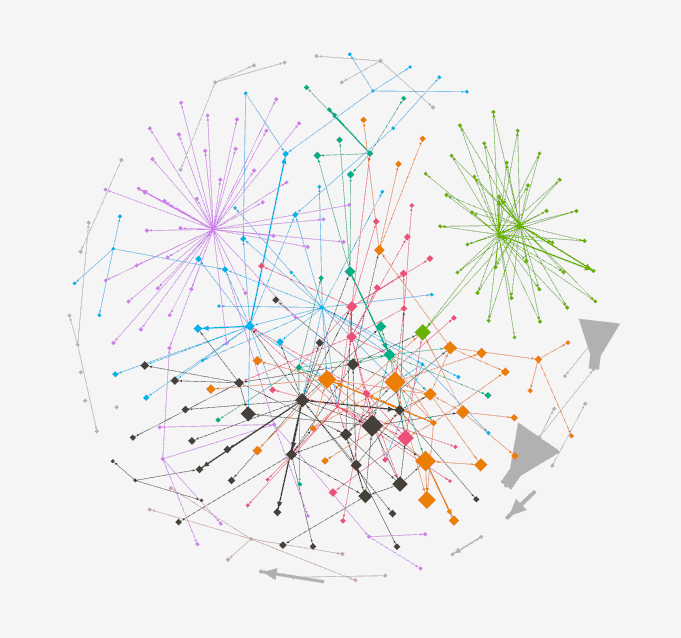

<!-- .slide: data-background-image="img/reveGeneral.png" -->
<!-- .slide: class="hover"-->

# La littérature “brouhaha” au défi de la visualisation de texte

 Servanne Monjour (servanne.monjour@paris-sorbonne.fr)

 <!-- .element: class="logo" -->

§§§§§§§§§§§§§§§§§§§§§§§§§§§§§§§§§§§§§§§§§§§§§
<!-- .slide: data-background-image="img/instinss.jpg" -->
<!-- .slide: class="hover"-->

Défi de visualisation, défi cartographique

===

En écrivant ces derniers jours ma communication, j'ai d'abord pensé en modifier quelque peu le titre, puisque davantage que le "défi de la visualisation de texte", ce que le colloque me paraît interroger avec force, c'est surtout le défi de la cartographie des corpus numériques - c'est-à-dire, finalement, une étape qui fait partie intégrante de la visualisation de texte, ou plus précisément l'étape préparatoire à toute tentative de visualisation.

La fouille et la visualisation de corpus informatisées constituent une branche florissante des Humanités numériques, y compris des humanités numériques littéraires, qui relèvent de facto de la pratique cartographique : visualiser un corpus, c'est en proposer une représentation graphique reposant sur un certains nombre de codes et de conventions préalablement définies par le chercheur/codeur/concepteur de l'outil, et par les possibilités de la machine.

§§§§§§§§§§§§§§§§§§§§§§§§§§§§§§§§§§§§§§§§§§§§§
<!-- .slide: data-background-image="img/instinss.jpg" -->
<!-- .slide: class="hover"-->

===
La visualisation de corpus littéraire, cela peut donc ressembler à cela : ici la cartographie d'un réseau de "livres préférés" calculés en fonction des tweets de lecteur, réalisée par Martin Geandjean.

§§§§§§§§§§§§§§§§§§§§§§§§§§§§§§§§§§§§§§§§§§§§§
<!-- .slide: data-background-image="img/instinss.jpg" -->

===

Et, bien entendu, de la cartographie au sens strict, qui consiste à "mapper" des personnages ou des éléments diégétiques d'un récit ; des productions littéraires dans leur dimension éditoriales ; ou encore des auteurs eux-mêmes - il existe une déclinaison large des cartographies possibles, qui permettent d'explorer nos corpus et de nous aider à les interpréter.

Si vous commencez déjà à vous ennuyer ou à vous inquiétez, voire à vous révolter face à mes propos, c'est probablement que vous vous trouvez au bon endroit, à savoir dans un colloque rassemblant une communauté de littéraires (*even* Marcello).

Je citerai ici Stéfan et Geoffrey, afin de dissiper peut-être un grand malentendu :

§§§§§§§§§§§§§§§§§§§§§§§§§§§§§§§§§§§§§§§§§§§§§
<!-- .slide: data-background-image="img/instinss.jpg" -->

>Nous reconnaissons que la réaction sceptique chez le littéraire est tout à fait naturelle et nous estimons d’ailleurs qu’une bonne dose de scepticisme est essentielle lorsque se conjuguent analyse informatisée et herméneutique. Cela dit, nous souhaitons remettre en cause l’image dominante que nous fournit la société de l’ordinateur comme générateur prodigieux de données infaillibles et de graphiques inéluctables. Ce que l’on ignore souvent, c’est que l’ordinateur, grâce à la nature même du numérique, peut s’avérer une aide très puissante pour faire proliférer le nombre et les types de représentations d’un texte. Loin d’en réduire la souplesse et la richesse, les outils informatiques peuvent servir à multiplier la matière brute qui mène à de nouveaux constats, de nouvelles associations, de nouveaux arguments. La machine est l’engin du heureux hasard, contrainte seulement par l’imagination de son utilisateur. (Sinclair et Rockwell 2015)

<!-- .element: style="font-size:1.4rem" -->

===

Je déminerai d'ailleurs tout suite mon propre terrain, en précisant que je ne me compte absolument pas au rang des spécialistes de la visualisation - je m'y suis collée pendant une petite année à l'Université McGill (l'an dernier plus exactement), certes très bien entourée par Stéfan Sinclair, mais trop peu de temps pour faire autre chose qu'acquérir les bases de ce champ d'étude, ouvrir une première porte pour apercevoir immédiatement derrière des dizaines d'autres portes.

La communication que je vais présenter aujourd'hui un petit bilan de cette initiation à la visualisation, et plus particulièrement le récit de son échec. Un échec puisque si, au tout début de mon année de postdoc, je me voyais déjà partir à l'assaut de ce type de visualisation et pouvoir produire des dessins absolument spectaculaires en 3 mois, je me suis finalement cassé les dents sur l'étape préliminaire, la fameuse consitution du corpus.

Mais il ne s'agit peut-être finalement que d'un échec partiel car, je crois, ces difficultés ont en fait stimulé ma réflexion théoriques, à la fois sur la littérature numérique mais aussi sur son études. Un plan littéraire donc, et un plan épistémologique d'autre part.

§§§§§§§§§§§§§§§§§§§§§§§§§§§§§§§§§§§§§§§§§§§§§
<!-- .slide: data-background-image="img/instinss.jpg" -->

## Cartographier la littérature numérique ?
* Le chercheur cartographe
* Un corpus numérique éditorialisé/éditorialisable
* L'écrivain architecte

===

J'aimerais interroger la thématique cartographique de ce colloque au prisme de la notion de corpus littéraire, en revenant à des questions que l'on pourra trouver très basiques mais qui se posent dès lors que l'on souhaite constituer un corpus natif numérique à des fins d'analyses automatisées. Quelques remarques préalables :

- un corpus, en soit, n'existe pas : c'est le chercheur qui le construit toujours. Nous sommes donc des cartographes - cela étant, nous sommes des cartographes quelque peu déboussolés aujourd'hui, puisque nos outils, tout comme les modalités de production de la littérature contemporaine ont changé. Et parmi ces outils, on trouve en tout premier lieu la fameuse visualisation de corpus - *text mining* et *data visualisation* - qui occupent un vaste territoire au sein des HN. Avec une humilité qu'il faut tout de suite souligner, même si on a tendance à l'oublier : une carte n'est pas tant un outil de connaissance qu'un moyen d'objectivation et, dans le cadre de la visualisation de corpus notamment, une véritable méthode heuristique dont l'intérêt réside moins dans le résultat (c'est-à-dire la visualisation), que dans la méthodologie.

- nos corpus natifs numériques sont mouvants, fragiles, éphémères, hétérogènes bref, éditorialisés. Or peut-on seulement cartographier le web, dans la mesure où celui-ci engage un processus d'éditorialisation, que l'on peut définir, pour simplifier lourdement, comme un processus d'ouverture dans le temps et dans l'espace ?

- nos corpus natifs numériques sont aussi, quoiqu'on en dise, marginaux. La question de l'institutionnalisation comme de la légitimation est certes déjà mise sur les rails, et des colloques tels que celui-ci en sont la preuve - mais avouons que la locomotive ne tourne pas encore vraiment à plein régime, et que la réflexion sur le sujet reste tributaires de groupes certes très actifs et dynamiques, mais parfois un peu isolés du reste des collègues - le nom du groupe qui nous accueille et qui organise le colloque en est la preuve. Comment, donc, cartographier les marges ? Des marges qui d'ailleurs, parfois encore, sont volontaires, se posent comme des conditions à un projet ou à une esthétique?

- des écrivains architectes ? Des espaces marginaux.
 Opposition entre 2 gestes d'écriture, celui du cartographe et celui de l'architecte

Le chercheur cartographe : pourquoi ?

réseau à la carte : effets de distance et rapprochement dans le réseau que l'on peut reconstituer pour faire carte

Intérêt de la visualisation de corpus : Différentes cartes selon nos hypothèses, selon notre manière de dessiner les corpus
mise en abîme du pb de la mouvance

Ainsi, c'est la notion même de *corpus* qui me semble difficile à saisir dans le cadre d'un effort de cartographie.

<!--

Plan :
- GI : le corpus fantôme

- Technique 1 : propagation hypertexte
Cartographie d'un réseau (centrée texte-objet - étendue et logique d'un corpus), tentative d'archivage, éditorialiser un corpus

- Technique 2 : moissonnage python HTML
cartographie d'un brouhaha (centrée contenu des objets : médias, textes, contenus thématiques, voix chorale)

- Une métaconstruction : l'architecte
geste édito de carto: dessiner de la cohérence.
Exemple de wiki : documenter = créer
-->
%%%%%%%%%%%%%%%%%%%%%%%%%%%%%%%%%%%%%%%%%%%%%
<!-- .slide: data-background-image="img/instinss.jpg" -->

## Cas d'étude. _Général Instin_ : un corpus fantôme

source image: _Quand on écrira l’histoire secrète du vingt et unième siècle…_ sur remue.net  

<!-- .element: class="source" -->

===
Hinstin, c'est d'abord le nom d'un général français du XIXe siècle, mort et enterré en 1905 au cimetière du Montparnasse. Le caveau est orné d'un vitrail représentant le portrait photographique du défunt or, un portrait lui même en train de se décomposer - dans une belle mise en abîme de la mort.

§§§§§§§§§§§§§§§§§§§§§§§§§§§§§§§§§§§§§§§§§§§§§
<!-- .slide: data-background-image="img/vitrailOriginal.jpg" data-background-size="contain"-->

source image: _introduction au feuilleton collectif Général Instin_ sur remue.net

<!-- .element: class="source" -->

===

En 1997, ce portrait en décomposition attire l'attention d'un groupe d'artistes et d'écrivains, parmi lesquels la photographe Juliette Soubrier, qui saisit plusieurs clichés de ce portrait fantomatique.

La même année (1997) Patrick Chatelier, écrivain français que l'on connaît notamment aujourd'hui pour être l'un des principaux éditeurs de publie.net, reprend cette photo pour la proposer comme contrainte créative lors d'une soirée de performance au squat artistique de la Grange aux belles (Paris).

§§§§§§§§§§§§§§§§§§§§§§§§§§§§§§§§§§§§§§§§§§§§§
<!-- .slide: data-background-image="img/ProcesDeLArt.jpg" data-background-size="contain"-->

===

Un mot peut-être sur la Grange-aux-Belles : haut lieu de la culture alternative parisienne dans les années 1990, le Squat de la Grange-aux-Belles était un bâtiment privé illégalement occupé par un collectif artistique, qui tentait de mettre en place des projets de création communs, et qui était basé sur un mode de gouvernance collectif.

Un lieu inscrit à la marge, donc, marge à la fois de la légalité, mais aussi d'un certain modèle institutionnel de l'art et de la légitimation artistique - qui repose sur l'individuation de l'auteur (cf. Nathalie Heinich)

L'endroit a depuis été détruit par la ville de Paris, entraînant d'ailleurs la disparition de nombreuses oeuvres et fresques murales qui faisaient la réputation du lieu.

§§§§§§§§§§§§§§§§§§§§§§§§§§§§§§§§§§§§§§§§§§§§§
<!-- .slide: data-background-image="img/revueGeste.png" data-background-size="contain"-->

source image: revue-geste.fr  <!-- .element: class="source" -->

===

Mais en 1997 nous n'en sommes pas encore là, et cette photo du Général va inspirer les artistes qui occupent le squat ou qui y transitent pour quelques jours, quelques semaines.

Il va marquer le début d'un collectif relativement informel (bien que très pro-actif), qui donnera lieu à plusieurs événements littéraires (des lectures, des performances, des ateliers, etc.).

Au début, une première forme d'inscription se met en place dans une poignée de revues littéraires imprimées : la revue *Geste*, par exemple.

§§§§§§§§§§§§§§§§§§§§§§§§§§§§§§§§§§§§§§§§§§§§§
<!-- .slide: data-background-image="img/item-026.png" data-background-size="contain" -->

source image: remue.net

<!-- .element: class="source" -->
===
Lorsque la plateforme publie.net est créée en **XXX**, GI l'insvestit presque immédiatement.

Entre temps, Hinstin perd volontairement son "H" qui le faisait personnage historique, pour devenir un matériau narratif, platisque, sémiotique. Il devient ainsi Général Instin svt abrégé GI.

Publie va jouer un rôle d'agrégateur / centralisateur des productions consacrées à Instin : poèmes, récits, images en grand nombre (photos, peintures, etc.), vidéos mais aussi des enregistrements sonores (gardant une trace des ateliers, lectures, festivals où Instin poursuit son investissement des marges de la littérature).

Il faut dire que GI, sur le web, performe quelque peu son statut fantomatique en s'inscrivant de facto comme archive.

Désormais, GI a pris racine dans l'hypertexte, et commence à hanter le web.

§§§§§§§§§§§§§§§§§§§§§§§§§§§§§§§§§§§§§§§§§§§§§
<!-- .slide: data-background-image="img/item-036.png" data-background-size="contain" -->

source image: generalinstin.net  <!-- .element: class="source" -->

===
Ainsi, il se permet des incursions sur d'autres plateformes, des revues numériques comme, par exemple, *Hors-sol*

§§§§§§§§§§§§§§§§§§§§§§§§§§§§§§§§§§§§§§§§§§§§§
<!-- .slide: data-background-image="img/item-036.png" data-background-size="contain" -->

source image: generalinstin.net  <!-- .element: class="source" -->

===

Des sites dédiés à des projets fonctionnant de manière relativement autonome, dans une logique transmédiatique -
ce que nous avons nommé "Spin-off" - comme ici le site web generalinstin.net, qui consitue une archive de *Climax*, publié par ailleurs en version imprimée (j'y reviendrai).

§§§§§§§§§§§§§§§§§§§§§§§§§§§§§§§§§§§§§§§§§§§§§
<!-- .slide: data-background-image="img/item-036.png" data-background-size="contain" -->

source image: generalinstin.net  <!-- .element: class="source" -->

===

Et, bien sûr, GI investi aussi les écritures profilaires, avec un compte FB et Twitter (partagé par plusiers membres du collectif qui publient messages et images en fonction de leurs envies du moment, sans nécessairement consulter les autres).

Sur twitter, GI habite dans l'au-delà.

§§§§§§§§§§§§§§§§§§§§§§§§§§§§§§§§§§§§§§§§§§§§§
<!-- .slide: data-background-image="img/Hinstin-famille.jpg" data-background-size="contain" -->

source image: BNF  <!-- .element: class="source" -->

===

À noter qu'à force de se performer dans son propre archivage, Général Instin finit par être rattrapé par l'Histoire et sa grande H dont il avait tenté de s'émanciper.

Au cours des années 2000 en effet, Retour de bâton : le collectif découvre que la famille Hinstin (avec son H), a en fait partie liée depuis longtemps avec la littérature et les arts. On retrouve des Hinstin chez Jarry ou chez Kessel, notammnent.

La BNF, surtout, dispose même d'un fonds d'archive photo de la famille classée dans les dossiers consacrés à Lautréamont (la rumeur voulant qu'Isidore Ducasse ait entretenu une relation très étroite avec son professeur Hinstin, frère de notre général).

Comme quoi l'Histoire et l'histoire ne sont finalement pas si cloisonnées. Et le GI nous fait parfois penser à une somme de petites anecdotes reliées entre elles.  

§§§§§§§§§§§§§§§§§§§§§§§§§§§§§§§§§§§§§§§§§§§§§
<!-- .slide: data-background-image="img/sans_titre-2.jpg" data-background-size="contain"-->

§§§§§§§§§§§§§§§§§§§§§§§§§§§§§§§§§§§§§§§§§§§§§
<!-- .slide: data-background-image="img/instinPapier.png" -->

===
Enfin, depuis 2015, Instin est devenu une figure auctoriale à part entière. Pour fêter cela, il a réinvesti le modèle éditorial imprimé, aux Éditions du Nouvel Attila, qui lui a même dédié une collection à lui seul : la collection Othello. Trois ouvrages ont été déjà publiés : une anthologie, un récit *Climax*, une traduction de *Spoon River* d'Edgar Lee Masters, augmentés de nouveaux poèmes instiniens et fantomatiques - pour ceux qui ne le sauraient pas ou plus, Spoon River est un recueil de poèmes .

Comme toute contrainte, Instin finira par se dérober à lui-même, en devenant totalement polymorphe - sa fonction et son statut littéraires en constante évolution, au gré de nombreuses appropriations.

Pour preuve, assez récemment, Instin est devenu une figure auctoriale : son nom trône en couverture de 3 ouvrages (une anthologie, un récit de fiction, une traduction d'edgar Lee Masters). Sur les réseaux sociaux, il compte ses propres profils et parle en son nom. Au cours de ce processus d'éditorialisation, Instin s'est donc aussi autorisé.

Instin incarne ainsi des tendances ou des traits saillants des nouvelles pratiques d'écriture à l'ère numérique :
- une forte tendance à l'appropriation, et son corollaire :
- une ouverture du concept d'autorité
- un déplacement - ou en tout cas, une revalorisation d'une écriture qui se déploie en marge des sentiers battus de l'édition littéraires.

§§§§§§§§§§§§§§§§§§§§§§§§§§§§§§§§§§§§§§§§§§§§§
<!-- .slide: data-background-image="img/corpusFantome.png" -->

source image: _lexique généraliste_ sur remue.net

<!-- .element: class="source" -->

===
Instin est donc un corpus fantôme.
La métaphore peut sembler facile pour parler d'une figure elle-même spectrale, mais elle revendiquée par le collectif.
[CITER]
Nous tenons tout particulièrement à cette expression qui évoque l'un de nos principaux défis : par sa nature processuelle, une partie de notre corpus semble toujours un peu sur le point de se dérober, voire sur le point de disparaître. En même temps, ce corpus est vivant et continue de se construire en même temps que nous l'étudions.

Instin est un fantôme, performé par le récit sans cesse réitéré de sa disparition, qui lui donne finalement un supplément d'existence.

§§§§§§§§§§§§§§§§§§§§§§§§§§§§§§§§§§§§§§§§§§§§§
<!-- .slide: data-background-image="img/vitrailOriginal.jpg" data-background-size="contain" -->
<!-- .slide: class="hover"-->

### De Hinstin à Instin

* Une contrainte créative (pour un groupe d'artistes)
* Un projet collectif (mais "sans engagement", ni "projet esthétique")
* Une figure **H**-istorique devenue romanesque
* Une figure auctoriale (qui signe des livres et vous parle sur Twitter)

source image: _La place du mort_ sur remue.net

<!-- .element: class="source" -->

===

§§§§§§§§§§§§§§§§§§§§§§§§§§§§§§§§§§§§§§§§§§§§§
<!-- .slide: data-background-image="img/editionInstin.jpg" -->

§§§§§§§§§§§§§§§§§§§§§§§§§§§§§§§§§§§§§§§§§§§§§
<!-- .slide: data-background-image="img/editionInstin.jpg" -->
<!-- .slide: class="hover"-->

### Du modèle hors-livre à la MarGInalité

* Occupation des marges (les marges de la ville puis du web)
* Dissémination sur plusieurs supports/plateformes
* Investissement de l'espace public
* *Avec* le livre plutôt que *contre* le livre !

source image: _Général Instin_ sur facebook.com

<!-- .element: class="source" -->

===
Ce qui nous intéresse notamment dans le projet GI est aussi ce qui nous cause le + de difficultés: GI se conçoit principalement dans un "hors-livre", en rupture avec notre modèle éditorial moderne.

Depuis le squat de la Grange aux belles, Instin s'est toujours s'inscrit relativement à la marge - des institutions littéraires ou éditoriales traditionnelles.

Il est disséminé sur plusieurs supports, numériques/non-numériques, sur plusieurs plateformes, via des médias différents. Qu'il s'affiche sur les murs de nos rues ou sur le web, Instin occupe l'espace public - en même temps qu'il participe à redéfinir l'espace public à l'ère numérique.

De l'investissement d'un squat dans une rue de Paris jusqu'à l'investissement du web, des réseaux sociaux qui sont détournés pour créer un profil "fictif", nous avons tendance à croire qu'il y a là une même stratégie d'occupation des marges et de détournement des institutions, qui est essentiel pour comprendre les mutations qui affectent la notion même de littérature.

§§§§§§§§§§§§§§§§§§§§§§§§§§§§§§§§§§§§§§§§§§§§§
<!-- .slide: data-background-image="img/10458166_10153074634228797_4994304635406227180_n.jpg" -->
<!-- .slide: class="hover"-->

### Une littérature "brouhaha"

> le [fait] littéraire aujourd’hui apparaît en très grande partie comme une arène conflictuelle composée d’une sphère publique hégémonique reposant sur l’imprimé et d’une multitude d’espaces publics contre-hégémoniques relevant plutôt d’une « littérature-brouhaha » (exposée, performée, in situ, multi-support) avec de très nombreuses circulations entre eux. »
>
> Lionel Ruffel, _Brouhaha, Les Mondes du contemporain_

<!-- .element: style="font-size:1.6rem; text-align:justify" -->

===
Lionel Ruffel a proposé le terme de "littérature brouhaha" pour qualifier ce passage d'un imaginaire du littéraire centré sur le livre comme objet-support, à un imaginaire du littéraire centré sur une action et une pratique : la publication.
[CITER]

%%%%%%%%%%%%%%%%%%%%%%%%%%%%%%%%%%%%%%%%%%%%%
<!-- .slide: data-background-image="img/10458166_10153074634228797_4994304635406227180_n.jpg" -->

## Essai cartographique numéro 1 : baliser le collectif (approche réseau)

§§§§§§§§§§§§§§§§§§§§§§§§§§§§§§§§§§§§§§§§§§§§§
<!-- .slide: data-background-image="img/mashupInstin.png" -->
<!-- .slide: class="hover"-->

### Méthodologie de recherche

* Recherche, collecte et indexation du corpus
* Chaîne d'archivage, encodage et édition
* Exploration des données
* Réflexion épistémologique sur le projet

===

A l'origine de notre projet, c'est l'intuition que ce qui était à l'oeuvre, et qui est toujours, avec le Général Instin est de nature à éclairer le questionnement de fond de la théorie de l'éditorialisation, sur la littérature, et sur son rapport au fait numérique.  
C'était aussi bien entendu, une curiosité toute scientifique face à un objet que l'on arrive à peine à nommer, un objet qui s'est employé très fort à brouiller les pistes d'une catégorisation possible, au point d'en faire un modus operandi.
>Par exemple, devrais-je dire : ce qui était à l'oeuvre _avec_ le général Instin ? ou _dans_ le général instin ? _sur_ le général instin ? On ne sait pas.

Devant un tel corpus, nous avons procédé de manière très organique, en élaborant notre méthodologie progressivement, de manière itérative en fonction des éléments que nous mettions à jour.

Nous pouvons séparer les différentes opérations en 4 tâches distinctes :
1. la recherche, la collection et l'indexation du corpus
2. l'implémentation d'une chaine de traitement pour encoder, archiver et éditorialiser le corpus
3. l'exploration et l'analyse des données récoltées
4. une réflexion continue, dont les axes se sont détachés et éclaircis progressivement. Ce sont ces axes de réflexions que nous présentons aujourd'hui, dans une version non aboutie.

Si ces 4 tâches peuvent sembler successives, nous les avons en fait mené de front, en parallèle, progressant pas à pas, selon les éléments collectés, selon les questions et hypothèses que nous souhaitions poser, selon les choix techniques que nous faisions pour les résoudre. Si l'on devait un jour aboutir ce projet, si tant est que cela soit possible, notre estimation du travail effectué se situe aux alentours de 10%. 10% qui nous ont servi à débrousailler un corpus, élaborer une chaine d'archivage, produire quelques visualisations, mais surtout identifier des axes de recherche et lever une piste, des pistes, à suivre.

A nouveau, au-delà de la question ontologique de ce qu'est Instin, de ce qu'il nous dit des modes de publications, de la littérature contemporaine, du réel, lorsque chacun de ces champs d'actions ou champs d'études sont confrontés et travaillés dans la culture numérique, au delà de ces questions donc, a rapidement émergé la question épistémologique de ce que nous faisions d'Instin, dans une démarche auto-réflexive, récursive, tout à fait fertile puisque venant en miroir éclairer la première. Nous allons voir comment.

§§§§§§§§§§§§§§§§§§§§§§§§§§§§§§§§§§§§§§§§§§§§§
<!-- .slide: data-background-image="img/inventaireAtom.png" -->
<!-- .slide: class="hover"-->

### _inventaire(.md)_

* Recherche, collecte et indexation :

  1. Exploration du corpus par propagation hypertextuelle

===

L'inventaire s'est déroulé en trois temps :
  1. Exploration du corpus par propagation hypertextuelle
  2. Captation systématique (en cours)
  3. Ajout de sources antérieures à GI

Dans un premier temps, l'objectif était de faire un ballon d'essai avec 10 items, de réfléchir à leur indexation, aux métadonnées dont nous aurions besoin. Nous sommes partis d'un texte intitulé «G.I. [04.06.09]», publié sur la plateforme Remue.net sous le nom de fichier article3322.html. Nous l'avons indexé, et recensé les liens hypertextes contenus dans le texte.

§§§§§§§§§§§§§§§§§§§§§§§§§§§§§§§§§§§§§§§§§§§§§
<!-- .slide: data-background-image="img/propagationHypertextuelle.png"  data-background-size="contain" -->

===

Nous avons alors suivi le premier lien hypertexte, menant au texte intitulé «La campagne d'Egypte» (article1524.html), puis le second, et ainsi de suite, chaque nouveau texte nous menant soit à de nouveaux items, soit à des items déjà collectés.

Cette démarche n'était pas tout à fait arbitraire, même si son point de départ l'était, car elle était guidée par l'idée que les textes s'écrivaient ensemble, se répondaient entre eux, et formaient en fait une certaine unité, informe pour le moment, mais dont les hyperliens traçaient des pistes de lecture et d'écriture, comme le début d'une matrice de sens qu'il restait à dévoiler.

Il ne nous a pas échappé cependant que cette exploration par propagation hypertextuelle devait en principe remonter le temps d'Instin, les auteurs ne pouvant se référer à des textes postérieurs. A moins peut-être qu'une main (ou qu'une intelligence artificielle) ne complexifie la matrice en éditant les textes publiés de nouveaux hyperliens vers des textes plus récents. Ce que nous découvrirons par la suite.

§§§§§§§§§§§§§§§§§§§§§§§§§§§§§§§§§§§§§§§§§§§§§
<!-- .slide: data-background-image="img/inventaireAtom.png" -->
<!-- .slide: class="hover"-->

### _inventaire(.xml)_

* Recherche, collecte et indexation :

  1. Exploration du corpus par propagation hypertextuelle
  2. Captation systématique (en cours)
  3. Ajout de sources antérieures à GI

Actuellement <i class="fa fa-arrow-right"></i> 76 _manifestations_ (dont 90% sources web)

===

A partir de 10, nous avons créé un fichier inventaire en xml et nous avons poursuivi cette approche par propagation hypertextuelle jusqu'à 30 items.

Puis nous sommes passés à une captation systématique, en nous appuyant sur les rubriques du site Remue.net. La captation est toujours en cours, nous en sommes à quelques 76 items, en incluant les éléments antérieures à GI : ce sont les éléments pré-instiniens, ceux dont servanne nous a parlé, notamment pour tenter de cerner Hinstin, au moins dans le temps.. timeline a suivre.

§§§§§§§§§§§§§§§§§§§§§§§§§§§§§§§§§§§§§§§§§§§§§
<!-- .slide: data-background-image="img/data-workflow.png" data-background-size="contain" -->

===

La suite de la chaine de traitement, la voici : de la collection où l'on retrouve l'inventaire dont je viens de parler, jusqu'à l'éditorialisation de l'archive.

La chaine est présentée ici de manière linéaire là les différentes étapes ont été conçues simultanément. On retrouve en rouge les moulinettes d'encodage, de traitement ou d'extraction des données. Le point notable de cette chaine est que nous nous basons sur BaseX, un système de gestion de base de données XML, qui nous permet à la fois de produire et d'encoder l'archive, mais aussi de l'exploiter, que ce soit à des fins d'analyse, ou à des fins de mise en ligne et de publication.

§§§§§§§§§§§§§§§§§§§§§§§§§§§§§§§§§§§§§§§§§§§§§
<!-- .slide: data-background-image="img/archiveTEI.png" data-background-size="contain" -->
<!-- .slide: class="hover"-->

### TEI
* HTML to TEI
* Paradoxe

===

Nous avons fait le choix de produire une archive en TEI, selon un schéma qui continue d'évoluer au fil de notre recherche.

Ce choix qui était dans un premier temps presque une évidence vis à vis de notre démarche s'est avéré paradoxal vis-à-vis de la nature du corpus.

Évidence, car tout d'abord, en tant que digital humanist, nous nous inscrivions ainsi dans une communauté de pratique, en bénéficiant de ses ressources et de son expérience. Mais aussi évidence, car notre approche était initialement centrée sur le texte, anticipant un travail de texte mining prometteur sur un contenu aussi disparate.

Et pourtant... d'une part le corpus se révèle beaucoup plus transmédiatique qu'une simple collection de texte, et donc potentiellement peu adéquate aux orientations de la TEI. Par ailleurs, il n'était pas question de procéder à un encodage fin des aspects de mise en forme, pour lequel se déploie toute la puissance de la TEI sur de l'encodage de manuscrit par exemple.

Mais surtout, pour ceux qui ont déjà eu à faire à la conception ou la manipulation d'un schéma XML, l'idée même d'un "schéma Général Instin" semble un paradoxe complet, pour ne pas dire une aberration.

Malgré tout, dans ces premiers pas de collections de textes présent sur le web, le passage d'un format HTML à un autre format continue de faire sens pour la production d'une archive.

§§§§§§§§§§§§§§§§§§§§§§§§§§§§§§§§§§§§§§§§§§§§§
<!-- .slide: data-background-image="./img/Composition3Graphes_large.png" data-background-size="cover" -->
<!--  .slide: class="hover"-->

### Un collectif ouvert, mais structuré
* un ensemble ouvert et dynamique, mais fini
* centralité de certains acteurs et plateformes

===
Et pourtant, notre travail d'archivage nous a progressivement amenés à cerner le corpus en un ensemble, certes ouvert, mais fini. Avec un nombre d’auteurs, de contributions, de plateformes maîtrisables. Elle nous montre par ailleurs que c'est un corpus malgré tout organisé et éditorialisé.

En fait, ce que nous a montré nos premiers pas dans la constitution de l'archive GI, c'est qu'il existe malgré tout des noeuds de cristallisation, des acteurs à la centralité plus ou moins prégnante, des formes, elles-mêmes investies de leur dispositif.

§§§§§§§§§§§§§§§§§§§§§§§§§§§§§§§§§§§§§§§§§§§§§

 <!-- .element: width="60%" -->

_Spatialisation (Fruchterman Reingold) et Centralité de vecteur propre_  <!-- .element: style="font-size: 1.4rem" -->

===
C'est notamment ce que nous révèle cette première spatialisation du réseau de documents déjà référencés dans l'archive, calculée à partir des liens hypertexte inter-documents.

L'algorithme de spatialisation choisi est volontairement neutre, de manière à révéler des relations, des lignes de forces, mais sans trop les caractériser : cela nous permet de garder un lien particulier avec les sources et poursuivre une lecture rapprochée.

Mais ce qu'elle nous montre très clairement, c'est que le corpus s'agence, se partitionne.

Ici, le calcul de centralité confirme qu'il existe dans ce corpus des hubs, des textes plus importants que les autres, davantage cités que les autres, ...

(centralité de vecteur propre (eigen vector))

§§§§§§§§§§§§§§§§§§§§§§§§§§§§§§§§§§§§§§§§§§§§§

 <!-- .element: width="50%" -->
 <!-- .element: width="40%" -->

_La campagne d’Égypte_, Patrice Chatelier (2006)  

<!-- .element: style="font-size: 1.4rem" -->

===
comme c'est le cas de La Campagne d'Egypte de Patrice Chatelier, un des premiers textes du GI sur remue.net.

Pour le moment, les résultats sont biaisés par le fait que notre première approche pour la collection du corpus (pour les 30 premiers items) a été de procéder par propagation à partir des liens hypertextes, et que donc nécessairement, les premiers items collectés sont particulièrement connectés entre eux.

§§§§§§§§§§§§§§§§§§§§§§§§§§§§§§§§§§§§§§§§§§§§§

 <!-- .element: width="60%" -->

_Modularité_  <!-- .element: style="font-size: 1.4rem" -->

===
Ici, le calcul de modularité nous donne une partition en une dizaine de "communautés", ce qu'on n'interprétera pas à ce stade à cause d'un corpus incomplet, mais cela vient ...

%%%%%%%%%%%%%%%%%%%%%%%%%%%%%%%%%%%%%%%%%%%%%
<!-- .slide: data-background-image="img/iLoveInstin.jpg" data-background-size="contain" -->

## Tentative numéro 2 : visualiser le brouhaha (approche textuelle)

====

Even if "Visualizing brouhaha" is the title of my presentation, I will not show many visualizations today. I'm rather going to present how I'm struggling to produce visualizations of a quite challenging corpus, that come under what we may call a "brouhaha literature". "Brouhaha literature" is a concept proposed by the french theoritecian Lionel Ruffel in 2016, and ever since more and more used in French literary studies.

I will explain and illustrate in details the concept later, but quickly, let say that brouhaha-literature refers to somes new kinds of heterogeneous corpora, composed of very disseminated sources in and outside the web. Thoses sources can be textual, visual, sound, performance, etc.

Although relevant, and refering to a very large part of contemporary writing and artistic practices, this concept of "brouhaha literature" can be very challenging for computational literary analysis, since the tidy notion of a work to be analyzed is replaced by a never-ending sequence of questions about what belongs and how to apprehend it.

§§§§§§§§§§§§§§§§§§§§§§§§§§§§§§§§§§§§§§§§§§§§§
<!-- .slide: data-background-image="img/sans_titre-2.jpg" -->
<!-- .slide: class="hover" -->

### Visualizing "brouhaha literature":
* can we find some patterns in this cacophony?

source image: _introduction au feuilleton collectif Général Instin_ sur remue.net

<!-- .element: class="source" -->

===

In fact, "visualizing Brouhaha" may appear like an nonsense: the principle of this literature is to be chaotic.

My question, to carry the metaphor, is: can we see some patterns in this brouhaha? Is it just a cacophony, or can we identify some echos, or even maybe a choral organization?

It was a nice challenge, and I want to thank Stefan Sinclair for his help on this crazy project, that partially failed, but partially only, because as we know, one of the main interest of vizualisation is the hermeneutic process involved in our research and methodology, that can reveal the complexity of our objects.

<!-- .slide: data-background-image="img/abnormal.png" data-background-size="contain"-->
<!-- .slide: class="hover" -->

## Building the corpus Instin (and the problems begin)
* An old website
* Several editors
* Problems of structuration

===

Before visualizing the abd confront the notion of brouhaha, I had to collect and prepare my corpus. I chose to focus on 3 websites where we can find Instin stories:
- Remue (this huge platform dedicated to french contemporary literature)
- generalinstin.net (a website dedicated to a specific project)
- hors-sol (a quite recent web Journal)

I was able to extract 152 items - or pages - so it's just a part of the corpus (probably 50%), but it's probably the most important one, in terms of visibility.

The web scraping process hasn't been as easy as expected, because of my level in python (I'm a beginner), but also because of the structure of the data, especially on Remue.net.

Remue is an old platform, playing a major role in the production and diffusion of the French contemporary literature. The website is a spip, a CMS used a lot in the french area.

Working on remue allowed me to make some kind of archeology of the website, and I was able to see how, during the last 12 years, the CMS had been sometimes too rigid for the writers and the editors, who had to do small "hacks" in order to adapt the structure of the CMS to their texts and poetry.

It's also possible to recognize the work of the differents editors or webmasters working who worked on the pages.

In other words, the structuration of the data, on the website, is quite dirty and, with Stefan's help, we had to do many regex...

§§§§§§§§§§§§§§§§§§§§§§§§§§§§§§§§§§§§§§§§§§§§§

<!-- .slide: data-background-image="img/abnormal.png" data-background-size="contain"-->
<!-- .slide: class="hover" -->

## Methological questions
* granularity
* "nature" of the literary text
* co-authoship

===

The web scraping process also raised some interesting methodological question:
- the question of granularity: some texts are very long, composed of several other texts (what's the best strategy: considering a page, or part of the page?)
- the question of the nature of the literary text: I'll talk about it in a few minutes, but the corpus on Remue contains some "un-creative" texts, as, for example, some announces for an event, for a performance or a festival dedicated to Instin. This is certainly part of the brouhaha, but it adresses the question of the boundaries of literature.
- Co-authorship: in many cases, for a same page or item, there are very different kind of contributors. This problem occurs with the video contents, where we have a film-maker, the writer of the text, the performers...

Instin is a group, a collective: we have to take into account all those different kind of contributors in order to grasp ots dynamic.

§§§§§§§§§§§§§§§§§§§§§§§§§§§§§§§§§§§§§§§§§§§§§
<iframe width="853" height="480" src="https://www.youtube.com/embed/GjBZXtWrw0A" frameborder="0" allow="accelerometer; autoplay; encrypted-media; gyroscope; picture-in-picture" allowfullscreen></iframe>

### GI, a "brouhaha" or "canon"?   (about the "jambon laissé" phenomenon)

===

Regarding the video content, I will just tell you a small anecdote.
While I was working on the transcription of a the video, using the automatic transcription tool of Youtube (which is usually quite performant), I came across an well-known issue that we call, in french "jambon laissé".

"jambon laissé" refers to the translation proposed by some automatic translator systems: "Hamlet", the shakespearian play, is interprated as "Ham - let" or, in french "jambon laissé".

In other words, my transcription was completely absurd and unusable. Why? Because in this video, the reading performance was a canon, the musical concept of the canon: all the readers were reading the same text, together, but with a small gap between them.

I think "canon" is a very promising concept to understand the brouhaha literature: I still need to explore it.

§§§§§§§§§§§§§§§§§§§§§§§§§§§§§§§§§§§§§§§§§§§§§

<!-- .slide: data-background-image="img/voyantall.png" data-background-size="contain" -->

### (eventually) Vizualising [a little bit]

===

So as you can see, I've been struggling a lot with my corpus, but eventually I managed to create an exploitable corpus, organized by authors and by dates.

I used Voyant to produce some very simple vizualisations, and I'm going to show just a very small but interesting example.

As I told before, the different artists and writers involved into the project use three ways to "call" the Général: "Hinstin" (from the historical figure), its artistic doppleganger "Instin", and also the abbreviation "GI", which offers many interpretations (like, for example, the american figure of the soldier).

If you take a look at the distribution of those names in the corpus through time, we can observe, without surprise, that "Instin" is mainly used in almost all the texts, from the first to the last one.

§§§§§§§§§§§§§§§§§§§§§§§§§§§§§§§§§§§§§§§§§§§§§

<!-- .slide: data-background-image="img/voyantGI.png" data-background-size="contain" -->

===

But it's interesting to note the way Hinstin but is in fact haunting our corpus, regularly making appearances in different text. A closer look at the text reveal Hinstin mostly re-appears into introductive texts to sub-projects.

Hinstin with a "H" is haunting the Instin corpus.

This reiteration underline the presence of an important metadiscourse on the project and corpus itself.

Instin is a ghost, performed by the reiterated story of his disappearance, which finally gives him a supplement of existence.

<!--	Exported from Voyant Tools (voyant-tools.org).
The iframe src attribute below uses a relative protocol to better function with both
http and https sites, but if you're embedding this into a local web page (file protocol)
you should add an explicit protocol (https if you're using voyant-tools.org, otherwise
it depends on this server.
Feel free to change the height and width values or other styling below: -->
<iframe style='width: 894px; height: 488px;' src='//voyant-tools.org/tool/Trends/?query=hinstin&query=instin*&corpus=9f88ad835e5c8fcd0d744c00d055a374'></iframe>

§§§§§§§§§§§§§§§§§§§§§§§§§§§§§§§§§§§§§§§§§§§§§

<!-- .slide: data-background-image="img/oeil.jpg" -->
<!-- .slide: class="hover" -->

### Archive 3.0

>The use of archives by artists, critics, and curators in performative contexts has changed the way we understand and work with archives. So, for example, archives, as we have seen, are increasingly utilized as production tools (Osthoff 2009, 11) causing what has been described as a “contamination between artwork and documentation” (p. 11), artworks and archives, archives and found objects, archival practices and everyday life. This changing function of the archive has transformed it from “stable and retroactive” to “generative” (p. 12), which means that the user of the archive also plays a productive part in this process. (Gabriela Giannachi, *Archive Everything: Mapping the Everyday* (2016))

<!-- .element: style="font-size:1.4rem" -->

===

This metafictionnal aspect also explains why I was struggling with my "corpus".

What I was treating as a corpus seems to be primarily an archive.

The construction of the archive goes with the construction of the group metafiction's.

In text mining, the organization of the "corpus" doesn't matters so much. But in this case, the material aspect are important.

In the future, I'll need to explore this tension between the primary corpus and the archive fonction: I need to understand how Instin is build by the "archive", and how this archive aims to become an artistic item.

Archive 3.0 = performative aspect.

§§§§§§§§§§§§§§§§§§§§§§§§§§§§§§§§§§§§§§§§§§§§§
<!-- .slide: data-background-image="img/archive.png" -->
<!-- .slide: class="hover"-->

### Éditorialiser l'archive GI : le chercheur cartographe ou architecte ?

Double dynamique :
  * ouverture et continuité : rendre l'archive publique et appropriable
  * réflexivité : que nous dit le design de l'archive sur le dispositif GI lui-même

===

Et c'est là que se joue l'enjeu épistémologique du projet, dont l'enjeu n'est pas simplement l'archivage d'instin, mais l'éditorialisation de l'archive, et l'espace ainsi produit.

L'éditorialisation de l'archive nous inscrit dans une double dynamique :

1. en ouvrant l'archive au public, aux communautés de chercheurs et d'auteurs, nous nous inscrivons dans la continuité de l'esprit Instin, dont une des pierres angulaires est l'appropriation. L'archive vient donc à la fois refléter le GI, mais aussi l'étendre, le remettre en mouvement et générer potentiellement de nouvelles écritures.  L'ouverture et la continuité qui caractérisent l'éditorialisation s'appliquent pleinement dans notre démarche.
  * ce qui nous fait poser la question : sommes nous certains que toute cette production scientifique est un épiphénomène lié à instin, ou participe-t-elle d'instin ? est-on en train de produire sur la matrice instin, nous sommes nous vraiment extraits de la rhétorique instinienne ?
2. par ailleurs, une dynamique de réflexivité car le design même de l'archive que nous produisons, ce dispositif d'éditorialisation, ou encore cet espace Instin Studies, nous dit des choses du dispositif Instin ou de l'espace, du milieu Instin. Et c'est pourquoi l'archive et son éditorialisation n'est pas l'aboutissement du projet, mais peut-être le commencement d'une réponse sur ce qu'est le dispositif Instin, sur ce qu'est Instin et comment il procède, ou plutôt en tant que fait littéraire, comment il performe le réel.
  * Ce pari est celui d’un dialogue entre le dispositif de publication littéraire du GI et le dispositif d’une archive scientifique. Un dialogue tout en tension, tout en contradiction peut-être, mais dont la démarche fait sens pour considérer l’archive non pas comme une tentative de totalisation de GI, mais plutôt de projection en miroir, elle-même excroissance du projet.

Instin travaille notre archive, comme l'archive travaille Instin, et ces deux performativités produisent et sont la production de deux espaces distincts.

%%%%%%%%%%%%%%%%%%%%%%%%%%%%%%%%%%%%%%%%%%%%%
<!-- .slide: data-background-image="img/iLoveInstin.jpg" data-background-size="contain" -->
<!-- .slide: class="hover"-->

### Merci !
